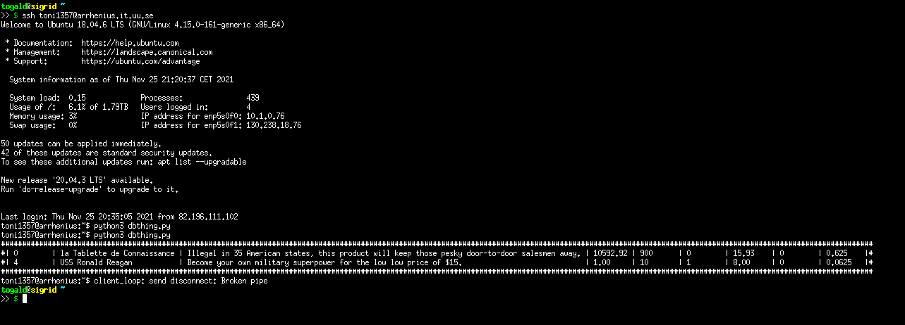

# Database technology 1 project

Studium says to connect to one of the IT department's machines through an SSH tunnel, then work on the script locally and it should work. However, it does not, and despite a lot of trial and error I have not got SSH tunneling to work inside of Python (yet). The current way to run the script is: 

1. Open a terminal and copy the script to one of the remote machines. I use Arrhenius because I already have a keyfile added (which means no password prompts). 

```bash
   scp dbthing.py toni1357@arrhenius.it.uu.se:/home/toni1357/db1 
```

2. Connect normally to Arrhenius via SSH (or any of the IT department's Linux machines) as per the instructions in Studium. 

```bash
   ssh toni1357@arrhenius.it.uu.se
```

3. Run the script. 

```bash
   python3 dbthingy.py
```

The script is supposed to work with any SQL command and automatically changes the table's cell sizes to fit the data. Here's an example:


